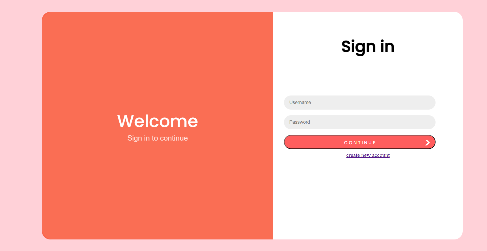

# User Authentication System

This is a Java-based web application implementing a simple user authentication system using servlets. It provides basic functionalities for user registration, login, and session management.

## Features

- **User Registration:** Allows users to create new accounts with a unique username and a securely hashed password.
- **User Login:** Provides authentication using stored credentials, granting access upon successful login.
- **Session Management:** Maintains user sessions for authenticated users.

## Technologies Used

- Java Servlets
- MySQL Database
- BCrypt for password hashing

## Project Structure

- `src/` - Contains the Java servlets and backend logic.
- `webapp/` - Includes HTML, CSS, and frontend resources.
- `database/` - SQL scripts for database setup and schema.

## Setup Instructions

1. **Database Configuration:**
   - Create a MySQL database and execute the provided SQL scripts (`database/setup.sql`).
   - Update `DB_URL`, `DB_USER`, and `DB_PASSWORD` in the servlets accordingly.

2. **Project Setup:**
   - Clone the repository.
   - Import the project into your preferred Java IDE.

3. **Run the Application:**
   - Deploy the project on a servlet container (e.g., Apache Tomcat).
   - Access the application via the browser at `http://localhost:8080/UserAuth`.

## Usage

- Access the login and registration functionality via the respective HTML pages.
- Test the user authentication flow by registering a new user and then logging in.

## Contributing

Contributions are welcome! Feel free to open issues or submit pull requests with improvements or additional features.

